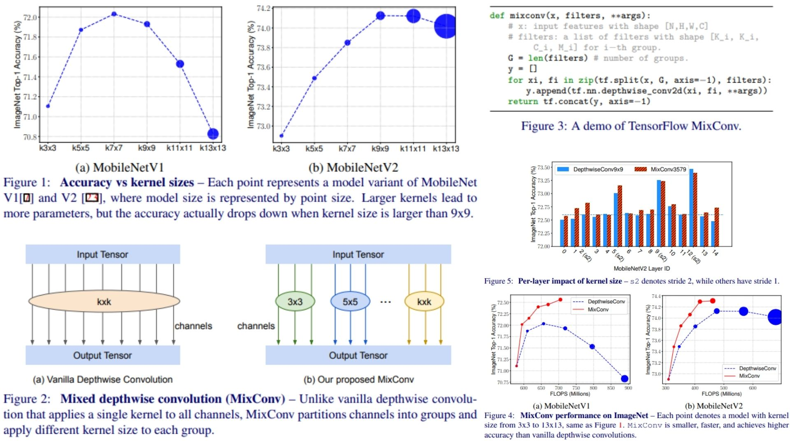

# 🍱 MixConv-Replication — Mixed Depthwise Convolutional Kernels

This repository provides a **faithful PyTorch replication** of  
**Mixed Depthwise Convolutions (MixConv)**, a convolutional design that  
captures **multiple receptive field sizes within a single layer** by  
mixing kernel sizes **across channel groups**.

The goal of this project is **architectural fidelity and conceptual clarity** —  
translating the paper’s **design intuition, mathematical formulation, and block structure**  
into clean, modular code, **without training, datasets, or empirical benchmarking**.

Core properties:
- **Channel-wise kernel mixing** instead of multi-branch fusion ⟡
- **Depthwise convolutions with heterogeneous kernel sizes** ⟢
- **Fixed, deterministic channel partitioning** (no attention, no gating) ⟣
- Minimal computational overhead with MobileNet-style compatibility ⟤

**Paper reference:**  [MixConv: Mixed Depthwise Convolutional Kernels (Tan & Le, BMVC 2019)](https://arxiv.org/abs/1907.09595) ⧉


---

## ⟡ Overview — Mixing Receptive Fields Inside a Single Layer



> In standard CNNs, each convolutional layer is restricted to  
> **one kernel size**, enforcing a uniform receptive field across channels.  
> **MixConv breaks this constraint by distributing multiple kernel sizes  
> across channel groups within the same depthwise convolution.**

Instead of branching the network (as in multi-path architectures),  
MixConv operates **within a single layer**:

- Input channels are partitioned into disjoint groups
- Each group is convolved with a different kernel size
- Outputs are concatenated along the channel dimension

This design allows the network to represent **multiple spatial scales simultaneously**,  
while preserving the efficiency of depthwise convolutions.

Crucially, receptive field diversity is achieved **structurally**,  
not dynamically — there is **no input-conditioned selection or attention**.

---

## 🧮 Mixed Depthwise Convolution Formulation

Given an input feature map

$$
X \in \mathbb{R}^{C \times H \times W},
$$

MixConv defines a set of kernel sizes

$$
\mathcal{K} = \{k_1, k_2, \dots, k_M\},
$$

and partitions the channel dimension such that

$$
C = \sum_{m=1}^{M} C_m.
$$

---

### Channel Partitioning

The input tensor is split along channels:

$$
X = \text{Concat}(X^{(1)}, X^{(2)}, \dots, X^{(M)}),
$$

where

$$
X^{(m)} \in \mathbb{R}^{C_m \times H \times W}.
$$

The partitioning is **fixed and deterministic**,  
typically using equal or logarithmic allocation across kernel sizes.

---

### Mixed Depthwise Convolution

Each channel group is processed independently using a depthwise convolution  
with its assigned kernel size:

$$
Y^{(m)} = X^{(m)} * K^{(m)}, \quad K^{(m)} \in \mathbb{R}^{k_m \times k_m}.
$$

All convolutions are depthwise:

- No cross-channel mixing
- One kernel per channel

The final output is obtained via channel-wise concatenation:

$$
Y = \text{Concat}(Y^{(1)}, Y^{(2)}, \dots, Y^{(M)}),
$$

yielding

$$
Y \in \mathbb{R}^{C \times H \times W}.
$$

---

## ⚙ Architectural Interpretation

- **Receptive field diversity is encoded structurally**
- No soft attention, no competition between scales
- Different channels specialize in different spatial extents
- Fully compatible with pointwise ($$1 \times 1$$) convolutions
- Designed for efficient mobile and embedded architectures

MixConv is typically followed by a pointwise convolution to enable  
**cross-channel interaction**, mirroring the MobileNet design philosophy.

---

## 🧩 Repository Structure

```bash
MixConv-Replication/
├── src/
│   ├── kernels/
│   │   └── kernel_sizes.py
│   │
│   ├── layers/
│   │   ├── depthwise_conv.py
│   │   └── mixconv.py
│   │
│   ├── blocks/
│   │   ├── mixconv_block.py
│   │   └── inverted_residual.py
│   │
│   ├── models/
│   │   ├── mobilenet_stub.py
│   │   └── mixnet_stub.py
│   │
│   ├── utils/
│   │   └── visualization.py
│   │
│   ├── pipeline.py
│   └── config.py
│
├── images/
│   └── figmix.jpg
│
├── requirements.txt
└── README.md
```
---


## 🔗 Feedback

For questions or feedback, contact: [barkin.adiguzel@gmail.com](mailto:barkin.adiguzel@gmail.com)
